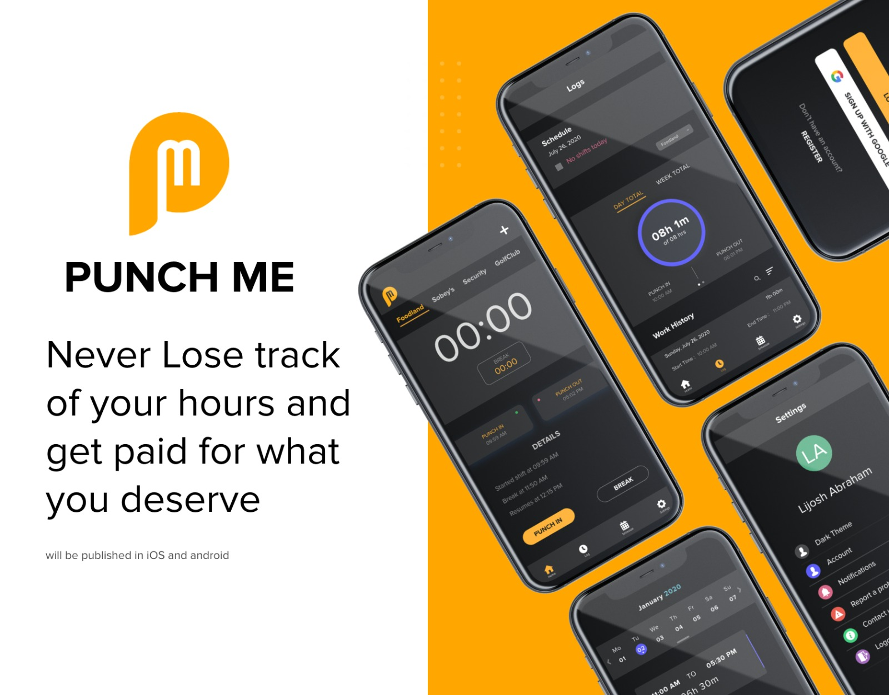

# PunchMe

## Never Lose track of your hours and get paid for what you deserve

See the design of the app here
https://xd.adobe.com/view/6d741a86-0280-48dd-b1ea-c83ac14c9f69-3827/specs/

- This application will be published in iOS and android and developed using react native.
- Punch Me application is an employee aid to calculate and manage his/her hours weekly/monthly and generate an estimate of the expected pay.
- Using the app, the user can stay organised in the hours worked and get an overall insight of working and keep a track of his break hours.
- Users can add multiple jobs and maintain the hours worked systematically.
- Considering International students having a limit of 20 hours per week. Punch Me helps to maintain a record for the hours worked and to never go beyond the limitation.
- Punch Me application helps users to maintain a schedule and calculate the hours based on it.
- User can punch In to start the shift and the time will be calculated from start.
- User can take breaks in between the time will also be calculated based on it.
- Finally after the shift is done the user punch Out.
- All the past shift details and hours worked will be shown in the logs tab.
- Users can add schedule for the upcoming shifts in the schedule section therefore depending on the schedule for the shift the user is been updated for starting the shift. (the scheduled shift will be shown in home page)
- Users can view the weekly , bi-weekly or monthly history of hours worked and the payment respectively.
